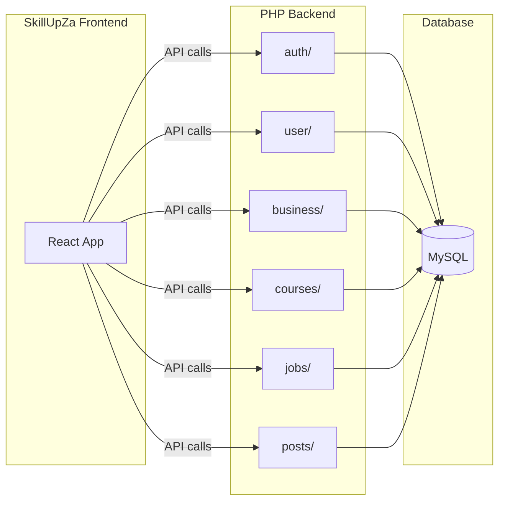

# PHP Backend Deployment Guide

This document explains how to deploy the SkillUpZA PHP backend to a hosting provider. Use this guide if you want to run your own backend instance or deploy the project from scratch.

## Architecture Overview



## Prerequisites

- **PHP 8.x** - Server-side scripting
- **MySQL/MariaDB** - Database
- **Composer** - PHP dependency manager
- **Git** - Version control
- **Account** on your chosen host (Render recommended, InfinityFree or Railway optional)

## Backend Codebase Options

### Restructured (Recommended)

The [backend-SkillUp](https://github.com/MrSolution07/backend-SkillUp) repository uses a folder structure:

```
backend-SkillUp/
├── auth/          # Login, register, BusinessLogin, Bus_register
├── business/      # bus_update, bus_delete, get_bus_details, etc.
├── config/        # database.php, cors.php
├── courses/       # add_course, getCourse
├── database/      # skillup.sql (schema)
├── jobs/          # JobPosting, getJobs
├── posts/         # create_post, get_posts, get_image
├── user/          # getpicture, update_user, delete, etc.
├── vendor/        # Composer dependencies
├── index.php
└── composer.json
```

### Flat Structure

The `DATABASE_CONFIG` folder in this project contains a flat structure with all PHP files in one directory. Both structures work; the restructured version is easier to maintain.

## API Endpoint Mapping

| Category | Endpoint | Method | Purpose |
|----------|----------|--------|---------|
| **Auth** | `auth/Login.php` | POST | User login |
| | `auth/register.php` | POST | User registration |
| | `auth/BusinessLogin.php` | POST | Business login |
| | `auth/Bus_register.php` | POST | Business registration |
| **User** | `user/getpicture.php` | GET | Get user profile picture |
| | `user/get_user_details.php` | POST | Get user profile |
| | `user/update_user.php` | POST | Update user profile |
| | `user/delete.php` | POST | Delete user account |
| | `user/update_user_password.php` | POST | Change user password |
| | `user/upload_profile_picture.php` | POST | Upload profile picture |
| **Business** | `business/get_bus_details.php` | POST | Get business profile |
| | `business/get_bus_picture.php` | GET | Get business picture |
| | `business/bus_update.php` | POST | Update business profile |
| | `business/update_bus_password.php` | POST | Change business password |
| | `business/bus_delete.php` | POST | Delete business account |
| **Courses** | `courses/add_course.php` | POST | Add course |
| | `courses/getCourse.php` | GET | Get courses by username |
| **Jobs** | `jobs/getJobs.php` | GET | List all jobs |
| | `jobs/JobPosting.php` | POST | Create job (also returns list) |
| **Posts** | `posts/get_posts.php` | GET | List all posts |
| | `posts/create_post.php` | POST | Create post |
| | `posts/get_image.php` | GET | Get post image by ID |

Full URL example: `https://your-backend.onrender.com/auth/register.php`

---

## Render Deployment (Recommended)

Render does not support PHP natively; you must use Docker.

### 1. Add Docker Files to Backend Repo

Create these files in the root of your backend repository.

#### Dockerfile

```dockerfile
FROM richarvey/nginx-php-fpm:latest

COPY . /var/www/html/

RUN if [ -f composer.json ]; then composer install --no-dev --optimize-autoloader; fi

EXPOSE 80

CMD ["/start.sh"]
```

#### .dockerignore

```
.git
.gitignore
.env
*.md
```

### 2. Configure Database Connection for Render

Update `config/database.php` to use environment variables:

```php
<?php
$host     = getenv('MYSQL_HOST') ?: getenv('MYSQLHOST');
$port     = getenv('MYSQL_PORT') ?: getenv('MYSQLPORT') ?: 3306;
$user     = getenv('MYSQL_USER') ?: getenv('MYSQLUSER');
$password = getenv('MYSQL_PASSWORD') ?: getenv('MYSQLPASSWORD');
$database = getenv('MYSQL_DATABASE') ?: getenv('MYSQLDATABASE');

if (!$host || !$user || !$password || !$database) {
    die("Database configuration missing. Set MYSQL_HOST, MYSQL_USER, MYSQL_PASSWORD, MYSQL_DATABASE.");
}

$conn = new mysqli($host, $user, $password, $database, (int)$port);
if ($conn->connect_error) {
    die("Connection failed: " . $conn->connect_error);
}
?>
```

### 3. Create MySQL on Render

1. Go to [render.com](https://render.com) and sign up.
2. **Dashboard** → **New** → **MySQL**.
3. Create the MySQL instance (name, region).
4. Once ready, note the **Internal Database URL** or individual env vars: `MYSQL_HOST`, `MYSQL_USER`, `MYSQL_PASSWORD`, `MYSQL_DATABASE`, `MYSQL_PORT`.

### 4. Create Web Service

1. **New** → **Web Service**.
2. Connect GitHub and select `backend-SkillUp` (or your backend repo).
3. **Environment**: **Docker**.
4. **Region**: Same as MySQL.
5. **Instance Type**: Free (for development).

### 5. Environment Variables

Add these under **Environment**:

| Key | Value |
|-----|-------|
| `MYSQL_HOST` | From Render MySQL |
| `MYSQL_PORT` | `3306` |
| `MYSQL_USER` | From Render MySQL |
| `MYSQL_PASSWORD` | From Render MySQL |
| `MYSQL_DATABASE` | From Render MySQL |

### 6. Import Database Schema

After the MySQL instance is running:

1. Enable TCP Proxy on the MySQL service in Render.
2. Connect with a MySQL client (TablePlus, DBeaver, phpMyAdmin).
3. Run the schema from `database/skillup.sql` in this project (see [Database Setup](#database-setup) below).

### 7. Deploy

**Option A: Blueprint (recommended)**

1. Push this repo to GitHub.
2. In Render Dashboard: **Blueprint** → **New Blueprint Instance**.
3. Connect the repo. Render will detect `render.yaml` and create the Web Service.
4. Add env vars in the Web Service: `MYSQL_HOST`, `MYSQL_USER`, `MYSQL_PASSWORD`, `MYSQL_DATABASE`, `MYSQL_PORT` (from your MySQL instance).
5. Import `database/skillup.sql` into your MySQL database.

**Option B: Manual**

1. Push to GitHub.
2. **New** → **Web Service** → select repo.
3. Set **Environment** to **Docker**.
4. Add env vars (same as above).
5. Deploy.

Your API will be at `https://your-service-name.onrender.com`.

**Free Tier Notes:**
- Service spins down after 15 minutes of inactivity.
- First request after spin-down may take 30–60 seconds.
- 750 free instance hours per month.

---

## CORS Configuration

All API endpoints must send CORS headers. Create `config/cors.php` and require it at the top of every endpoint file.

#### config/cors.php

```php
<?php
header("Access-Control-Allow-Origin: *");
header("Access-Control-Allow-Methods: POST, GET, OPTIONS");
header("Access-Control-Allow-Headers: Content-Type, Authorization");
header("Access-Control-Max-Age: 86400");

if ($_SERVER["REQUEST_METHOD"] === "OPTIONS") {
    http_response_code(204);
    exit(0);
}
?>
```

#### Usage in Endpoints

```php
<?php
require("../config/cors.php");
require(__DIR__ . '/../config/database.php');
// ... rest of endpoint
?>
```

---

## Database Setup

Run the schema in `database/skillup.sql` to create all required tables.

### Tables

| Table | Purpose |
|-------|---------|
| `credentials` | User accounts (Username, Email, Password, ProfilePicture, etc.) |
| `business` | Business accounts |
| `images` | Post image attachments |
| `courses` | Course listings |
| `jobs` | Job listings |
| `posts` | Social posts (references images) |

### Import Steps

1. Open phpMyAdmin (or your MySQL client).
2. Select your database.
3. Go to **SQL** tab.
4. Paste the contents of `DATABASE_CONFIG/schema.sql`.
5. Click **Go**.

---

## MySQL for Render (Must Allow Remote Connections)

Since Render runs in the cloud, your database **must** allow remote connections. These options work:

| Provider | Free Tier | Remote MySQL |
|----------|-----------|--------------|
| **Railway** | Yes | Yes |
| **PlanetScale** | Yes | Yes |
| **db4free.net** | Yes | Yes |
| **InfinityFree** | Yes | **No** (local only) |

Use Railway or PlanetScale for a quick setup. Create the database, import `database/skillup.sql`, then add the connection vars to Render's Environment.

---

## InfinityFree (Optional, with Caveats)

InfinityFree offers free PHP + MySQL hosting but has important limitations for API usage.

### Known Limitations

1. **JavaScript Anti-Bot Challenge**: InfinityFree serves a JS challenge page on first request. Cross-origin API calls (e.g., from a React app on Vercel) often fail because:
   - The response is HTML, not JSON.
   - CORS headers may be absent.
   - The browser blocks the response.

2. **Best for**: Same-origin setups or direct browser navigation. **Not recommended** for a React SPA calling the API from a different domain.

### InfinityFree MySQL: No Remote Connections

InfinityFree **free hosting** does **not** allow remote MySQL connections. The database is only accessible from PHP scripts on the same InfinityFree server (or phpMyAdmin). If you deploy your PHP backend on Render, Railway, or any other host, it **cannot** connect to InfinityFree MySQL.

**Use a remote-accessible MySQL instead:** Railway, PlanetScale, db4free.net, or similar.

### Database Configuration (InfinityFree, for same-server PHP only)

If you host your PHP on InfinityFree (same server as the DB), configure `config/database.php` with direct credentials:

```php
<?php
$servername = "sqlXXX.infinityfree.com";  // From InfinityFree control panel
$username   = "if0_XXXXXXXX";
$password   = "your_password";
$database   = "if0_XXXXXXXX_skillup";
$port       = 3306;

$conn = new mysqli($servername, $username, $password, $database, $port);
if ($conn->connect_error) {
    die("Connection failed: " . $conn->connect_error);
}
?>
```

---

## Frontend Configuration

Point the SkillUpZA React app to your backend URL.

### Option 1: Environment Variable (Recommended)

1. Add to `.env`:
   ```env
   VITE_API_URL=https://your-backend.onrender.com
   ```

2. In components, use:
   ```javascript
   const apiUrl = import.meta.env.VITE_API_URL || '';
   axios.post(`${apiUrl}/auth/register.php`, phpData);
   ```

3. Replace hardcoded backend URLs in components with `${apiUrl}/auth/...`, `${apiUrl}/jobs/...`, etc.

### Option 2: Hardcoded Base URL

Replace all backend URLs (e.g., `https://skillaupza.free.nf/`) with your backend base URL (e.g., `https://your-backend.onrender.com/`).

### Components That Call the API

- `src/Components/JoinNow/Register.jsx`
- `src/Components/ProfileLogin/Login.jsx`
- `src/Components/ProfileLogin/BusinessLogin.jsx`
- `src/Components/JoinNow/BusinessRegister.jsx`
- `src/Components/UserSettings/*`
- `src/Components/CompanySettings/index.jsx`
- `src/Components/Social/*`
- `src/Components/Cards/CoursesCardDashboard.jsx`
- `src/Components/JobPosting/index.jsx`
- `src/Components/ViewDetails/index.jsx`
- `src/Pages/Dashboard/*`
- `src/Pages/Dashboard/Jobs/jobs.jsx`
- `src/Pages/Dashboard/MyCourses/index.jsx`

---

## Verification

### 1. Test Jobs Endpoint (GET)

```bash
curl https://your-backend.onrender.com/jobs/getJobs.php
```

Expected: `{"success":true,"jobListings":[]}` or similar JSON.

### 2. Test Register (POST)

```bash
curl -X POST https://your-backend.onrender.com/auth/register.php \
  -F "username=testuser" \
  -F "email=test@example.com" \
  -F "password=Test123!@#" \
  -F "mobile=0123456789"
```

Expected: `{"success":true,"message":"User registered successfully"}` or an error JSON.

### 3. Test from Frontend

Run the SkillUpZA frontend locally and try:
- Register a new user
- Login
- View jobs

---

## Troubleshooting

| Error | Cause | Fix |
|-------|-------|-----|
| **CORS policy: No 'Access-Control-Allow-Origin'** | Missing CORS headers | `config/cors.php` is included; ensure all endpoints require it |
| **403 Forbidden** | Host blocking requests | Try Render; some free hosts block API/ datacenter traffic |
| **Empty reply / Connection reset** | Host anti-bot or JS challenge | Switch from InfinityFree to Render |
| **Connection failed** | Wrong DB credentials | Check `config/database.php` and env vars |
| **Table doesn't exist** | Schema not imported | Run `DATABASE_CONFIG/schema.sql` in your MySQL database |

---

## Summary

| Step | Action |
|------|--------|
| 1 | Use [backend-SkillUp](https://github.com/MrSolution07/backend-SkillUp) or flat `DATABASE_CONFIG` |
| 2 | Dockerfile, .dockerignore, config/cors.php already in place |
| 3 | Deploy to Render (recommended) or another host |
| 4 | Create MySQL and import `database/skillup.sql` |
| 5 | Set `VITE_API_URL` (or base URL) in frontend and rebuild |
