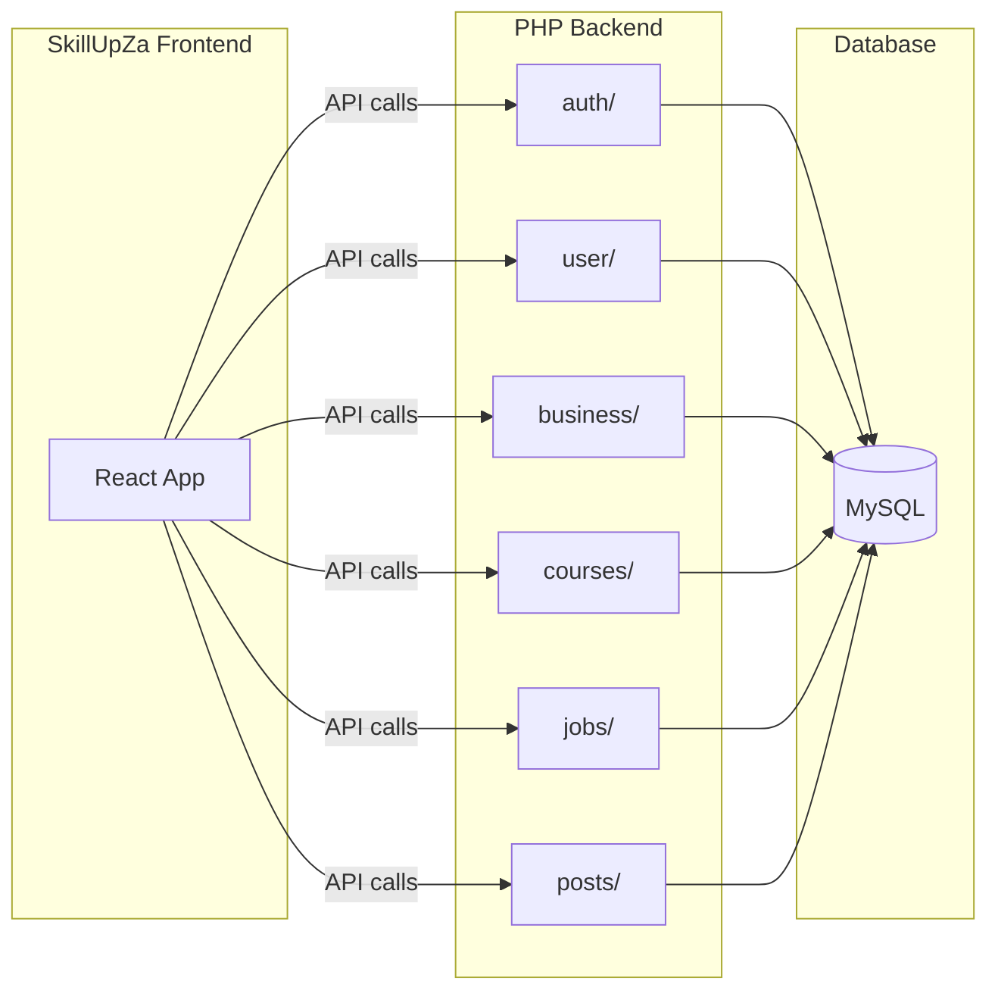

# PHP Backend Deployment Documentation

## Goal

Create a comprehensive deployment guide (`docs/DEPLOYMENT_PHP.md` or `DEPLOYMENT_PHP_BACKEND.md`) that enables anyone to deploy the SkillUpZA PHP backend to a hosting provider.

## Document Location

Create `**docs/DEPLOYMENT_PHP_BACKEND.md**` in the SkillUpZa project root. This keeps deployment docs organized and linked from the main [README.md](README.md).

## Document Structure

### 1. Prerequisites

- PHP 8.x
- MySQL/MariaDB
- Composer (for dependencies)
- Git
- Account on chosen host (Render, InfinityFree, or Railway)

### 2. Backend Codebase Options

- **Restructured** ([backend-SkillUp](https://github.com/MrSolution07/backend-SkillUp)): folders `auth/`, `business/`, `config/`, `courses/`, `jobs/`, `posts/`, `user/`
- **Flat** (in [DATABASE_CONFIG](DATABASE_CONFIG/)): single folder with `Login.php`, `register.php`, etc.

Document will focus on the **restructured** backend as the primary deployment target.

### 3. API Endpoint Mapping (for frontend)

Include a table of all endpoints:

- Auth: `auth/Login.php`, `auth/register.php`, `auth/BusinessLogin.php`, `auth/Bus_register.php`
- User: `user/getpicture.php`, `user/get_user_details.php`, `user/update_user.php`, `user/delete.php`, `user/update_user_password.php`, `user/upload_profile_picture.php`
- Business: `business/get_bus_details.php`, `business/get_bus_picture.php`, `business/bus_update.php`, `business/update_bus_password.php`, `business/bus_delete.php`
- Courses: `courses/add_course.php`, `courses/getCourse.php`
- Jobs: `jobs/getJobs.php`, `jobs/JobPosting.php`
- Posts: `posts/get_posts.php`, `posts/create_post.php`, `posts/get_image.php`

### 4. Render Deployment (Recommended)

- PHP on Render requires **Docker**
- Steps: create Dockerfile (nginx-php-fpm base), create MySQL instance on Render, create Web Service, set env vars
- Include Dockerfile template and `config/database.php` env-var handling for Render MySQL
- Note free-tier limits (750 hrs, spin-down after inactivity)

### 5. Database Setup

- Reference [DATABASE_CONFIG/schema.sql](DATABASE_CONFIG/schema.sql) for required tables
- Tables: `credentials`, `business`, `images`, `courses`, `jobs`, `posts`
- Instructions to run schema in phpMyAdmin or MySQL client

### 6. CORS Configuration

- Include `config/cors.php` content (Access-Control-Allow-Origin, OPTIONS preflight handler)
- Require it at top of all PHP endpoints

### 7. InfinityFree (Optional, with Caveats)

- Document known limitation: **JavaScript anti-bot challenge** blocks cross-origin API calls (axios/fetch from React)
- Only suitable if frontend and backend are same-origin or host allows CORS without the JS challenge
- Include database config format (direct host/user/pass/db)

### 8. Frontend Configuration

- How to set API base URL in the SkillUpZa React app
- Currently hardcoded URLs in ~18 files; suggest env var `VITE_API_URL` and replace base URL across components
- Example: `VITE_API_URL=https://your-backend.onrender.com` then `${import.meta.env.VITE_API_URL}/auth/register.php`

### 9. Verification

- Test endpoints: `GET /jobs/getJobs.php`, `POST /auth/register.php` (with FormData)
- Expected JSON responses

## Files to Create/Modify

| File                             | Action                                                         |
| -------------------------------- | -------------------------------------------------------------- |
| `docs/DEPLOYMENT_PHP_BACKEND.md` | Create new deployment guide                                    |
| `README.md`                      | Add link to deployment doc in Environment / Deployment section |

## Diagram (Optional)

## Implementation Notes

- Use markdown headers, code blocks, and tables for clarity
- Include exact env var names for each host (Render: MYSQL_HOST, MYSQL_USER, etc.; InfinityFree: direct credentials)
- Add troubleshooting: CORS errors, 403, empty response, schema import errors

